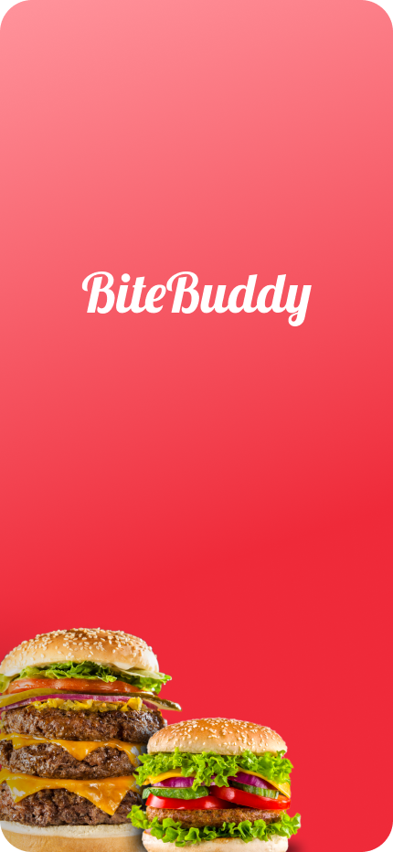
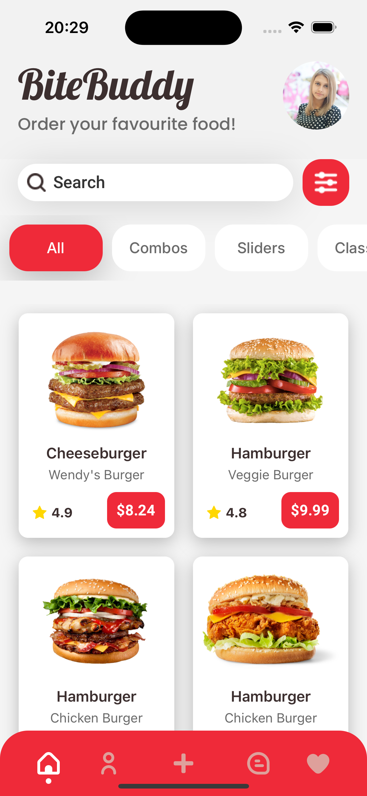
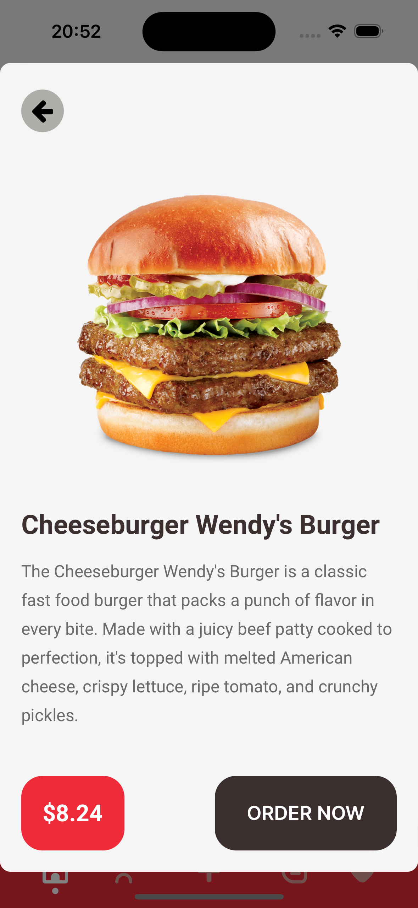

# BiteBuddy

## Introduction

I created this app in just a few hours to test my skills in React Native. It's still under development, and I'm building an easy-to-use burger app for ordering food. Below are some screenshots of the app in action.

Screenshots:

<div style="display: flex; justify-content: space-around;">
  
  
  
</div>

## Changelog

### Version 0.0.1

- Created `Product Detail Screen`
- Created `HomeScreen`
- Initial setup of the app
- Added basic burger ordering functionality

## Installation

To set up and run the project, follow the instructions below.

## Install dependencies

Run the following command to install the project dependencies:

```sh
npm install
```

## Run the app

To serve the app in development mode, use:

```sh
npx nx serve BiteBuddy
npx nx serve api
```

## Build the app

To create a production bundle, run:

```sh
npx nx build BiteBuddy
```
